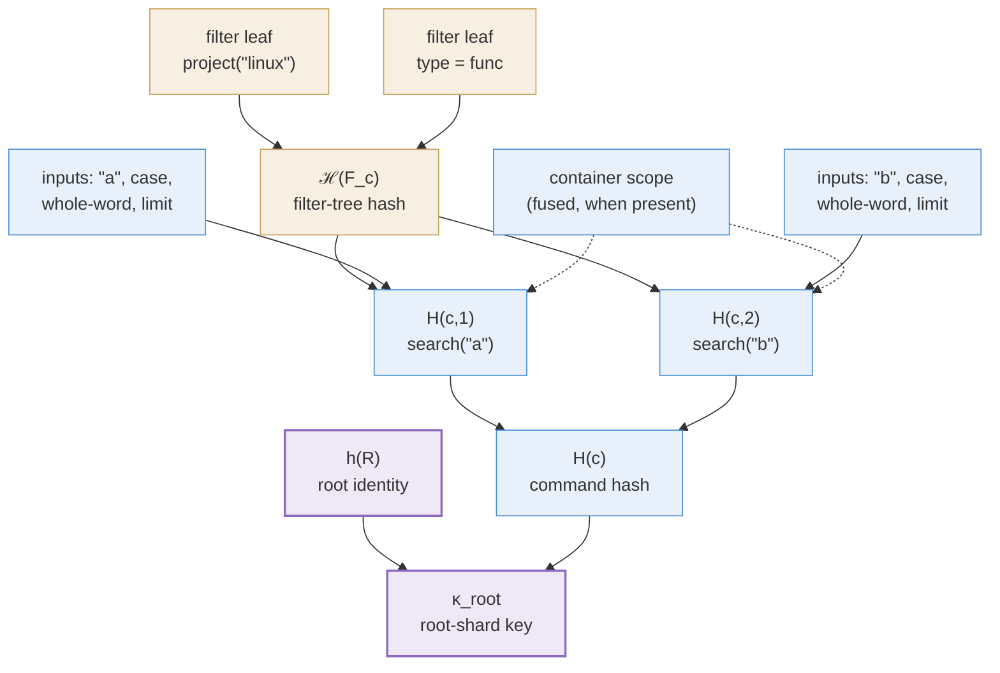

Every node in the [layer forest](/docs/design/shards) is
content-addressed: its cache key is a hash, and a cache hit means "this
node already exists, so its populate need not run". A key is therefore a
promise about what a populate reads, and one rule governs every hash on
this page:

> **Whatever a populate *reads*, its key must *name* — and nothing more.**

Both halves are load-bearing, and they fail in opposite directions. Name
too little and two populates that read different things collide on one
key: a query silently gets someone else's rows, which is a correctness
bug. Name too much and two populates that read the same things are given
different keys: each entry then hits only in the exact circumstances
that minted it, and the cache **fragments**. Fragmentation is the
cheaper failure, but not a cheap one — a key that named the whole
visible slice would be sound and nearly useless, which is why production
is carved into shards before it is keyed at all
([Partitioning a Materialisation](/docs/design/shards)).

The keys are built bottom-up: the filters a command carries (§1) and
their hash (§2), each verb's own inputs (§3) and their combination into
the command hash (§4), why that construction is not circular (§5), and
the three node keys the forest is addressed by (§6).

## 1. The filter predicate {#filter-predicate}

A key must name the filters in scope, or a scoped populate would collide
with an unscoped one. So the first question is what "the filters on a
command" even means.

Besides its content verbs a command carries **filters** — the units of
filter composition: a name pattern, a type constraint,
`project("linux")`, `ignore(...)`. (A *verb* is the generic execution
unit — see [Queries and their Meaning](/docs/design/semantics); most
filters arrive as verbs, but not all — a bare name string is a filter
without being a verb.) For keying and evaluation the filters are
combined into **one predicate** \(F_c\) — the conjunction of all of
them — represented as a tree: predicate leaves, combined by And/Or/Not
nodes.

Two details, each worth its own sentence:

- **Inheritance.** "All of them" means all filters *on the
  command* — which includes filters inherited from enclosing
  substatements (inheritable filters are copied into child commands at
  parse time). A nested command's \(F_c\) therefore already reflects its
  ancestors' constraints; nothing later needs to walk the enclosing
  substatements.
- **Uniformity.** \(F_c\) applies to every content verb of the command
  alike — physically at read time, where every read of the command's layers
  conjoins the same \(F_c\) over their rows; a populate consults at most
  \(F_c\)'s object-narrowing part to restrict what it scans
  ([semantics §5](/docs/design/semantics/#content-map)).

## 2. The filter hash {#filter-hash}

\(\mathcal{H}(F_c)\) is computed recursively over the predicate tree:

- each **leaf** hashes its own semantics: which predicate it is, and its
  arguments in canonical encoding;
- each **inner node** hashes an operator tag (And, Or, Not) followed by its
  children's hashes.

Two filters hash equally exactly when they are the same tree
([search()](/docs/design/search/#cache-key-composition) gives the
byte layout). This is the *only* filter-awareness mechanism in the whole
cache — no filter type is special-cased anywhere.

## 3. Per-verb input hashes {#verb-input-hashes}

A filter hash names the command's context; what remains is the verb
itself. Each content verb \(i\) of command \(c\) gets its own hash over
three ingredients — which verb it is, what it was given, and what of the
command's context its populate actually reads:

$$H(c,i) \;=\; \mathcal{H}\bigl(\, \mathrm{dom}(i) \,\Vert\, \mathrm{inputs}(i) \,\Vert\, \mathcal{H}(F_c) \,\bigr)$$

- \(\mathrm{dom}(i)\) — the verb discriminator (`"search"`, `"loc"`, …): a
  domain-separation tag, so different verbs with coincidentally equal
  argument bytes cannot collide;
- \(\mathrm{inputs}(i)\) — the verb's own arguments, canonically encoded and
  length-prefixed (for `search`: query bytes, case flag, whole-word flag,
  limit), together with its **fused scope** where it has one. A verb that
  restricts its populate to the enclosing container — `search` narrowing
  its scan to the parent substatement's byte ranges — reads that
  container's condition, so by the governing rule its key must name it,
  and the fused scope's condition (or its resolved instance ids) joins
  the verb's inputs. A verb that does not fuse (`loc`, single-file by
  construction) adds nothing here;
- \(\mathcal{H}(F_c)\) — present exactly when the populate *reads*
  \(F_c\), per the governing rule. `search` reads it: \(F_c\)'s object-level
  part narrows the scan's input corpus (a `project(...)` decides which
  projects' content is scanned at all), so the key must name it — and it
  names the whole tree via the shared §2 hash rather than extracting the
  object part, since that part is derived from the full tree. A verb
  whose populate reads nothing of \(F_c\) folds no \(\mathcal{H}(F_c)\):
  `loc`'s path and `project=` arguments already fix what it reads, and
  \(F_c\) reaches its rows only at read time.

## 4. Combining verbs: the command hash {#command-hash}

A command may carry several content verbs (`search("a") search("b")`),
all contributing to one node group. They are required to be **mutually
independent** — each is a self-contained populate, none reads another's
output, results combine by plain union. This is a keying requirement: no
\(H(c,i)\) folds any \(H(c,j)\), so a cross-verb dependency would mean a key
that fails to name one of its inputs.

The command hash is then \(H(c) = H(c,1)\) for a single verb (its key is
unchanged by the composition machinery — single-verb commands stay
cache-warm). For several verbs the per-verb hashes fold in **source
order**:

$$H(c) \;=\; \mathcal{H}\bigl(\, \mathrm{dom}_{\mathrm{composite}} \,\Vert\, H(c,1) \,\Vert\, \dots \,\Vert\, H(c,n) \,\bigr)$$

Each part is a fixed 32 bytes, so the concatenation needs no delimiters.
Source order does mean `search("a") search("b")` and its reverse key
different layers despite denoting the same union — harmless for correctness
(key soundness only needs same-key \(\Rightarrow\) same-content), at worst
one redundant materialisation.

## 5. Acyclicity {#acyclicity}

The definitions may look mutually recursive — \(H(c,i)\) folds
\(\mathcal{H}(F_c)\), and \(F_c\) is built from the same command — but the
two roles are **disjoint**: \(F_c\) is assembled from *filters* alone, and
content-producing verbs contribute nothing to it. The hash flow is
therefore a strictly layered DAG, filter leaves at the bottom and a node
key at the top:

## 6. Node keys {#node-keys}

\(H(c)\) names a command. A node key must also name the layer content its
populate is aimed at and the place the node occupies, and which of those
each kind of node names is settled by
[the shard partition](/docs/design/shards/#node-kinds): a **root shard**
\(\mathrm{Sh}_c(R)\) over a root layer \(R\), a **layer shard**
\(\mathrm{Sh}_c(\ell)\) over one light layer, and a **selection shard**
\(S_c\) hanging off the previous statement's spine tip. Their byte
layouts are

$$\kappa_{\mathrm{root}} \;=\; \mathcal{H}\bigl(\, \mathrm{dom}_{\mathrm{root}} \,\Vert\, h(R) \,\Vert\, H(c) \,\bigr)$$
$$\kappa\bigl(\mathrm{Sh}_c(\ell)\bigr) \;=\; \mathcal{H}\bigl(\, \mathrm{dom}_{\mathrm{layer}} \,\Vert\, \mathrm{id}(\ell) \,\Vert\, \kappa_{\mathrm{root}} \,\bigr)$$
$$\kappa\bigl(S_c\bigr) \;=\; \mathcal{H}\bigl(\, \mathrm{dom}_{\mathrm{sel}} \,\Vert\, \mathrm{id}(\mathrm{parent}) \,\Vert\, \kappa_{\mathrm{root}} \,\Vert\, \mathrm{extra} \,\bigr)$$

where \(\mathcal{H}\) is the raw cryptographic hash over byte strings,
\(\Vert\) byte concatenation, \(h(R)\) the root layer's stored identity
hash, and \(\mathrm{id}(\cdot)\) a database id — so a non-root node folds
its parent's *id*, never its parent's key. Every part is fixed-width or
length-prefixed, so nothing needs a delimiter. Three ingredients deserve
their own paragraph.

**The domain tags.** Every hash here begins with a **domain-separation
tag**: a literal byte string saying what kind of thing is being hashed.
The node kinds take `root-shard-v1`, `layer-shard-v1` and
`selection-shard-v1`; the composite command hash of §4 takes
`composite-input-v1`; a verb's discriminator (`"search"`, `"loc"`) plays
the same role one level down. Tags keep the families disjoint even over
identical payloads, and the version suffix is the upgrade path: bumping
it strands every old entry rather than aliasing it, so a change of
keying scheme needs no purge
([Caching](/docs/design/caching/#filter-aware-hashing)).

**\(\kappa_{\mathrm{root}}\) as an ingredient.** Only the root shard
folds \(H(c)\) directly; the other two reach the command *through*
\(\kappa_{\mathrm{root}}\). Each is thereby tied to the exact root-shard
incarnation it was cached against, and inherits its project scoping —
the root shard folds \(h(R)\), so the visible projects' key spaces are
already disjoint — for free.

**\(\mathrm{extra}\).** This is the governing rule applied to a node that
reads **more than the one input its parent names** (the code's
`selection_extra`). An input shard needs none: its content is a function
of the command's inputs and the rows of the single layer it is over. A
`layer { … }` block's ops, by contrast, may name specific ephemeral ids
from earlier statements, so those resolved ids join the key — and a block
cannot collide with one that shares everything else but its references.
Where a selection shard covers several such ops, its \(\mathrm{extra}\)
folds each part's, length-prefixed, in source order. For content
populates (`search`, `loc`) it is empty.

Those three shapes and the ingredients above are the whole key system:
below them, filters and verb arguments; above them, nothing.
[Partitioning a Materialisation](/docs/design/shards) is where the names
are spent — on losslessness, trustworthy cache hits, and reuse across
queries.
