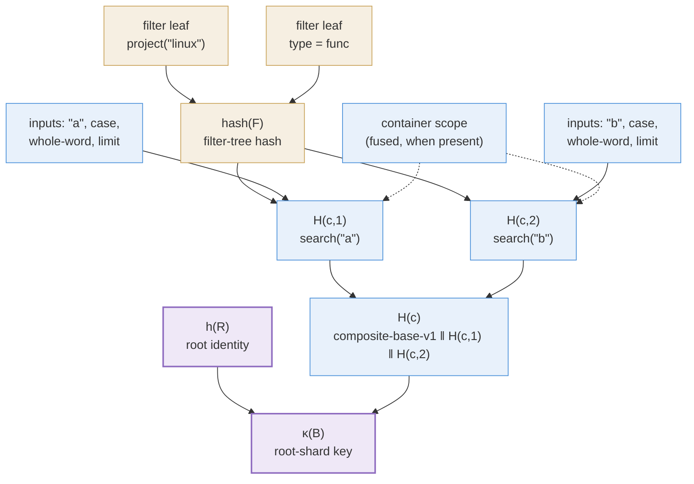

Every node in the [layer forest](/docs/design/layer-tree) is
content-addressed: its cache key is a hash, and a cache hit means "this node
already exists". This page explains how those keys are built, bottom-up. One
rule governs everything on this page:

> **Whatever a populate *reads*, its key must *name* — and nothing more.**

Name too little and two different results collide on one key (a correctness
bug). Name too much and identical results get distinct keys (a cache
fragmented for no reason). Each subsection below adds one ingredient.

## 1. The filter predicate F

Start with a single command. Besides its content verbs it
carries **filters** — the units of filter composition: a name pattern, a
type constraint, `project("linux")`, `ignore(...)`. (A *verb* is the
generic execution unit — see
[The Command Algebra](/docs/design/command-algebra); most filters
arrive as verbs, but not all — a bare name string is a filter without
being a verb.) For keying and
evaluation the filters are combined into **one predicate** \(F\) — the
conjunction of all of them — represented as a tree: predicate leaves,
combined by And/Or/Not nodes.

Two details, each worth its own sentence:

- **Inheritance.** "All of them" means all filters *on the
  command* — which includes filters inherited from enclosing
  substatements (inheritable filters are copied into child commands at
  parse time). A nested command's \(F\) therefore already reflects its
  ancestors' constraints; nothing later needs to walk the enclosing
  substatements.
- **Uniformity.** \(F\) applies to every content verb of the command
  alike — physically at read time, where every read of the command's layers
  conjoins the same \(F\) over their rows; a populate consults at most
  \(F\)'s object-narrowing part to restrict what it scans
  ([command-algebra §5](/docs/design/command-algebra/#5-the-content-map)).

## 2. The filter hash

\(\mathrm{hash}(F)\) is computed recursively over the predicate tree:

- each **leaf** hashes its own semantics: which predicate it is, and its
  arguments in canonical encoding;
- each **inner node** hashes an operator tag (And, Or, Not) followed by its
  children's hashes.

Two filters hash equally exactly when they are the same tree
([Design: search()](/docs/design/search/#cache-key-composition) gives the
byte layout). This is the *only* filter-awareness mechanism in the whole
cache — no filter type is special-cased anywhere.

## 3. Per-verb input hashes

Each content verb \(i\) of command \(c\) gets its own hash:

$$H(c,i) \;=\; H\bigl(\, \mathrm{dom}(i) \,\Vert\, \mathrm{inputs}(i) \,\Vert\, \mathrm{hash}(F) \,\bigr)$$

- \(\mathrm{dom}(i)\) — the verb discriminator (`"search"`, `"loc"`, …): a
  domain-separation tag, so different verbs with coincidentally equal
  argument bytes cannot collide;
- \(\mathrm{inputs}(i)\) — the verb's own arguments, canonically encoded and
  length-prefixed (for `search`: query bytes, case flag, whole-word flag,
  limit);
- \(\mathrm{hash}(F)\) — present exactly when the populate *reads*
  \(F\), per the governing rule. `search` reads it: \(F\)'s object-level
  part narrows the scan's input corpus (a `project(...)` decides which
  projects' content is scanned at all), so the key must name it — and it
  names the whole tree via the shared §2 hash rather than extracting the
  object part, since that part is derived from the full tree. A verb
  whose populate reads nothing of \(F\) folds no \(\mathrm{hash}(F)\):
  `loc`'s path and `project=` arguments already fix what it reads, and
  \(F\) reaches its rows only at read time.

## 4. Combining verbs: the command hash

A command may carry several content verbs (`search("a") search("b")`),
all contributing to one node group. They are required to be **mutually
independent** — each is a self-contained populate, none reads another's
output, results combine by plain union. This is a keying requirement: no
\(H(c,i)\) folds any \(H(c,j)\), so a cross-verb dependency would mean a key
that fails to name one of its inputs.

The command hash is then \(H(c) = H(c,1)\) for a single verb (its key is
unchanged by the composition machinery — single-verb commands stay
cache-warm). For several verbs the per-verb hashes fold in **source
order**:

$$H(c) \;=\; H\bigl(\, \text{composite-base-v1} \,\Vert\, H(c,1) \,\Vert\, \dots \,\Vert\, H(c,m) \,\bigr)$$

Each part is a fixed 32 bytes, so the concatenation needs no delimiters.
Source order does mean `search("a") search("b")` and its reverse key
different layers despite denoting the same union — harmless for correctness
(key soundness only needs same-key \(\Rightarrow\) same-content), at worst
one redundant materialisation.

## 5. Scope fusion

\(F\) is not the only command context a verb may fold. A verb that
restricts its populate to the enclosing container — `search` narrowing its
scan to the parent substatement's byte ranges — reads that container's
condition, so by the governing rule its \(H(c,i)\) must name it: the fused
scope's condition (or its resolved instance ids) joins the verb's inputs.
A verb that does not fuse (e.g. `loc`, single-file by construction) folds
nothing extra.

## 6. Acyclicity

The definitions may look mutually recursive — \(H(c,i)\) folds
\(\mathrm{hash}(F)\), and \(F\) is built from the same command.
There is no cycle because the two roles are **disjoint**: \(F\) is
assembled only from *filters*, and content-producing verbs
contribute nothing to it. The hash flow is a strictly layered DAG:

Filter leaves at the bottom; the filter hash above them; per-verb hashes
above that, each also folding its own arguments (and a fused scope when
present); the command hash at the top.

## 7. Node keys

The command hash \(H(c)\) is the "command inputs" ingredient of every node
key in the [layer forest](/docs/design/layer-tree): the root shard
(code: base) folds
\((h(R), H(c))\), a layer shard (code: per-layer node) folds
\((\mathrm{id}(\ell), H(c))\), the
selection shard (code: supplement) folds
\((\kappa(\mathrm{parent}), H(c), \mathrm{extra})\) — each
under its own domain tag: root shard
`base-rooted-v2`, layer shard `eph-perlayer-v1`, selection shard `eph-supplement-v1`,
so the three key families are disjoint even over equal payloads. The composite selection shard's `extra`
folds each part's extra, length-prefixed, in source order.

That table plus this page is the complete key system; the
[layer tree](/docs/design/layer-tree) page proves what it buys
(completeness, key soundness, reuse).
