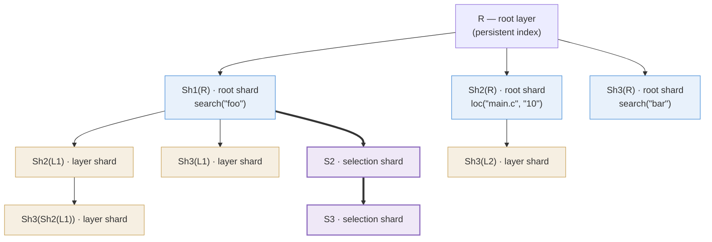

A statement's **materialisation** is the set of layers its layer-creating
commands add to the visible slice. The rows those layers hold have to be
stored somewhere, and *how* they are stored turns out to be a caching
question rather than a bookkeeping one.

A materialisation is not one opaque result. It is a set of
contributions with wildly different costs and lifetimes, and holding it
as a single unit lets the cheapest and most volatile of them decide the
fate of the most expensive — one ephemeral layer upstream, and a scan of
the whole corpus is redone.

So the storage takes the shape the caching problem dictates, and this
page derives it: §1 fixes the notation, §2 states the axiom a verb must
satisfy for the split to lose nothing, §3 carves the materialisation and
gives each part the key it earns, and §4 says why those keys can be
trusted; a worked example and the prior art close the page. The cache at
issue throughout is the database-backed one, shared across processes and
queries; the separate in-memory cache over *read* results plays no part
in the argument ([Caching](/docs/design/caching/#two-tiers)). For where
materialisation sits in the pipeline, see
[the life of a query](/docs/design/overview/#the-life-of-a-query).

## 1. Notation {#notation}

The layer data model — kinds, lifetimes, visibility, isolation,
garbage collection — belongs to
[Layers and layer operations](/docs/design/layers). This section fixes
only the symbols the argument uses.

**Layers and content.** \(C(\ell)\) is the **content** of a layer
\(\ell\): the rows physically stored on it — indexed facts (a symbol, an
instance of it, a reference to it) and, on a root, the indexed source
text those facts came from. Every stored row carries the layer it lives
on — **one row, one layer** — so distinct layers' contents are pairwise
disjoint and every union below is a genuine partition.

**Roots and slices.** \(R\) is a project's **root layer**, carrying a
stored **identity hash** \(h(R)\) that names the committed index state
it stands for (§4 makes that naming precise). Write \(\Lambda_t(R)\) for
the ordered **slice** visible on that project after statement \(t\): the
project's persistent closure — today just \(R\) itself
([Layers](/docs/design/layers/#kinds-and-lifetimes)) — followed by the
materialisations of statements \(1 \dots t\) in order. Existing layers,
the root included, are never written; a materialisation only ever adds
nodes.

**Statements and materialisations.** A query evaluates layer-creating
top-level statements \(t = 1, 2, \dots\) in source order, and each
produces one **materialisation**. Within the statement the
layer-creating unit is the *command*: each layer-bearing command \(c\) —
the statement's own or a nested substatement's — contributes one **node
group**, and the materialisation is the union of those groups. Nesting
never sequences — the statement separator is the only time axis
([terminology](/docs/design/overview/#terminology)) — and every populate
of statement \(t\) reads the slice as it stood after statement \(t-1\),
never a statement-mate's layers.

**Several projects at once.** A query runs against a set of visible
roots \(\mathcal{R}\), and a statement materialises for all of them **in
lockstep**: statement \(t\) appends one materialisation per root,
atomically. What the query binds is the union of the per-project slices,

$$V_t \;=\; \bigcup_{R \,\in\, \mathcal{R}} \Lambda_t(R)$$

and because those materialisations land together, the per-root spines
stay parallel and \(V_t\) is always a coherent snapshot. No node's
content is a function of another root's content, so cross-root state
never enters a key: the rest of the page works inside one slice, and
every symbol in it carries a silent \(R\).

**Borrowed symbols.** The command's **combined populate** \(U_c\),
which maps an input slice to every row the command's content verbs write
for it, and the **content map** \(f_c = \sigma_{F_c} \circ U_c\), which
conjoins the command's combined filter \(F_c\), are
[Queries and their Meaning](/docs/design/semantics/#content-map)'s: the
engine stores the \(U_c\)-image, and a read of that stored content
observes \(f_c\), so the algebra below runs over \(U_c\) and \(f_c\)
reappears where reads do (§3 — where a command that also builds rows
from earlier selections turns out to be observed as a little more than
\(f_c\)).
Hashes are [Keys](/docs/design/layer-keys)': \(\kappa(\ell)\) is the
cryptographic **node key** that is a layer's cache identity, and
\(H(c)\) the canonical **input hash** that summarises a command so that
equal hashes mean semantically identical commands. The single property
of \(H(c)\) used here is that it names every input the command's
populates read *except the layer contents they are aimed at* — those are
named by the node keys of §3 — and nothing else.

## 2. Verb semantics and the decomposition axiom {#decomposition-axiom}

Everything §3 builds rests on how the combined populate \(U_c\)
behaves row by row: its work splits along layers, and it writes nothing
for rows it does not read. This section states both.

How individual verbs' populates union into \(U_c\) belongs to
[Queries and their Meaning](/docs/design/semantics). The
tree never decomposes below one command's node group, so here \(U_c\)
is one opaque function: aimed at the content rows of some set of
layers, it returns the content the command writes for just those rows.
And because \(U_c\) is a function, the same work can be aimed at
different slices — \(U_c(C(R))\) is the populate aimed at the root's
content, \(U_c(C(\ell))\) the same populate aimed at one layer's
content. What makes aiming it at slices separately safe is that it
decides one row at a time:

> **Axiom (element-wise production).** For every corpus slice \(A\),
> $$U_c(A) \;=\; \bigcup_{x \,\in\, A} U_c(\{x\})$$
> — what the command writes for a slice is the collection of what it
> writes for each row of that slice, separately.

Two properties come out of that, and §3 spends both — the first
outright, the second with a little more asked of the verbs.

**Layer-decomposability.** Over any family of layers (their contents
are pairwise disjoint by §1),

$$U_c\Bigl(\bigcup_{\ell} C(\ell)\Bigr) \;=\; \bigcup_{\ell} U_c\bigl(C(\ell)\bigr)$$

since both sides collect the same per-row images, each row lying in
exactly one layer. A map with this property is an **additive map**: it
adds up over disjoint pieces the way lengths or counts do. Additivity
is what lets a populate be aimed at each layer separately and its
results stored separately, which is the whole of §3's carve.

**No read, no write.** The empty family is an instance of the same
equation — \(U_c(\emptyset) = \emptyset\), a populate aimed at nothing
writes nothing — and the populates below satisfy the sharper statement
it points at: aimed at rows their verbs never read, they write nothing
either. This is a property of populates rather than a consequence of
additivity, which is happy to let a map invent rows out of an input it
ignores; §3 needs it to justify giving no node at all to the layers it
leaves out.

By the same algebra \(U_c\) is a union of its content verbs'
populates, so both properties are really obligations on individual
populates. Substring search and location resolution meet them: a
byte-range match lies within exactly one **object** (one indexed
source file, itself a stored row), so each populate is per-row
behaviour computed one row at a time, and a row it has no use for — a
derived index row, an object outside its scope — yields nothing at
all. A cross-layer operation — one
whose output on a row depends on *other* layers' rows — fails exactly
that row-at-a-time character and is by construction no part of
\(U_c\): the command algebra routes such **selection-dependent** rows,
built from earlier statements' selections, out of the populates, and
§3 gives them their own node: the selection shard.

## 3. Partitioning: the three node kinds {#node-kinds}

**The problem.** A command \(c\) of statement \(t\) has to materialise
the rows its combined populate produces over everything visible:
\(U_c\bigl(\bigcup_{\ell \in \Lambda_{t-1}(R)} C(\ell)\bigr)\). Three
forces act on how that row set should be stored.

- **Cache the expensive.** The populate over the committed corpus is
  the costly part — scanning millions of indexed rows — and the corpus
  it reads almost never changes. Work like that must be stored once
  and reused.
- **Isolate the volatile.** Other inputs change constantly: an
  ephemeral layer appears, a referenced selection shifts by one row.
  Store the contribution as *one* node keyed on everything it read —
  the whole slice \(\Lambda_{t-1}(R)\) — and the cheapest, most
  volatile input dictates the fate of the most expensive work: one
  added layer upstream changes the key, so every **context** (every
  distinct history of ephemeral layers a query has built up) re-runs
  the corpus populate to produce rows an earlier context already
  produced. Keyed on the whole slice, the cache never hits across
  contexts.
- **Keep nodes few.** Every node is a row to insert and populate in
  its own transaction, and one more entry for eviction to track.
  Splitting is not free either.

The first two forces push towards splitting the contribution, the
third against it. The rest of this section carves it where they
balance.

**Step 1 — write down what a materialisation must produce.**
Everything statement \(t\) materialises on one root — its
**materialisation content** \(M_t\) — is the
union, over its layer-bearing commands \(c\), of one **contribution**
\(M_c\) per command: the combined populate over the pre-statement
slice, plus a **selection-dependent term** — rows the command builds
from each referenced output, \(g_c(o)\) per output. \(O_c\) is the
set of outputs the command references via `@labels` — **selections**
of *earlier* statements only, each complete once its statement has
fully run ([terminology](/docs/design/overview/#terminology),
[Evaluating the Fixpoint](/docs/design/evaluation)); a reference to
the defining statement or any later one is a parse error, the
**ordering rule**
([label ordering](/docs/syntax/#ordering-labels-reference-earlier-statements)).
In the current engine the term is realised by `layer { … }` ops, and
for a pure content verb \(O_c\) is empty. Each \(g_c\) is
**determinate** in the ids it is handed: the same output, resolved to
the same rows, yields the same \(g_c(o)\) — which is what later lets a
key name those rows by their ids and nothing else.

$$M_t \;=\; \bigcup_{c} M_c \qquad\quad M_c \;=\; U_c\Bigl(\,\bigcup_{\ell \,\in\, \Lambda_{t-1}(R)} C(\ell)\Bigr) \;\cup \bigcup_{o \,\in\, O_c} g_c(o)$$

The pre-statement read (§1) and the ordering rule combine into the
dependency invariant the whole tree leans on: **everything \(M_c\)
reads or points at exists in the pre-statement slice**. \(U_c\) reads
its content directly; each referenced output is the completed
selection of a statement that has fully run, and its resolved ids name
rows already stored. Nothing current or future is readable or
referenceable — which makes a statement's contributions mutually
independent and keeps every dependency edge the cache records (§4's
eviction) pointing only backwards in time.

**Step 2 — carve it along its dependencies.** Give each part a key
that names exactly what that part reads, and a change to one input can
invalidate only the parts that read it: volatility stops propagating
into expensive work. The carve is available because the selection term
is already per output — each op reads one selection — and the axiom
splits the content term per layer.

Write \(E_t(R)\) for the **content-bearing** light layers the
statement sees: the layers of \(\Lambda_{t-1}(R) \setminus \{R\}\)
that carry rows of the kinds content populates read at all — *light*
meaning any visible layer other than the root, currently the ephemeral
ones. Being content-bearing is a property of a layer's stored rows, not
of any one command, so the set is the same for every command of the
statement rather than something the statement has to agree on; and it is
enumerated from those rows before any populate runs, so it is
deterministic per query text and chain. A light layer outside it
contributes \(U_c(C(\ell)) = \emptyset\) by no read, no write, so giving
it no node loses nothing: the carve is exhaustive, not just disjoint.

One more symbol before the display. \(\mathrm{tip}_{t-1}(R)\) is the
**tip** of the chain of nodes recording query history — the last layer
statement \(t-1\) materialised, in command pre-order, with
\(\mathrm{tip}_0(R) = R\); the paragraphs after the table make it
precise and show it is deterministic. The carve, with the key each part
earns:

$$M_c \;=\; \underbrace{U_c(C(R))}_{\mathrm{Sh}_c(R)\;:\;(h(R),\,H(c))} \;\cup \bigcup_{\ell \,\in\, E_t(R)} \underbrace{U_c(C(\ell))}_{\mathrm{Sh}_c(\ell)\;:\;(\mathrm{id}(\ell),\,\kappa_{\mathrm{root}})} \;\cup\; \underbrace{\bigcup_{o \,\in\, O_c} g_c(o)}_{S_c(R)\;:\;(\mathrm{id}(\mathrm{tip}_{t-1}(R)),\,\kappa_{\mathrm{root}},\,\mathrm{extra})}$$

Each label names what that node's key names: **its parent's identity,
its command, and whatever else its content reads**. For the two shards
the parent *is* the input, so naming it settles content and placement at
once; the selection shard's parent is a position rather than an input,
and what its rows read is named by \(\mathrm{extra}\) — whatever a node
reads beyond the one input its parent names. The two non-root kinds
reach the command through \(\kappa_{\mathrm{root}}\), the root shard's
own key, rather than through \(H(c)\) directly, which ties each of them
to the exact root-shard incarnation it was cached against.

Each part is one node, and the three differ exactly as the three
forces predict:

- The **root shard** \(\mathrm{Sh}_c(R)\) holds the expensive populate
  over the committed bulk. Its key names the
  corpus and the command, nothing else, so no ephemeral change can
  reach it; only a mutation of the persistent index invalidates it
  (assumption A3 in §4).
- A **layer shard** \(\mathrm{Sh}_c(\ell)\) holds the same populate over
  one light layer, keyed by that layer's
  identity: of the context, only \(\ell\) itself. A layer appearing
  or vanishing invalidates its own shard and no other *input* shard —
  with one exception, since a layer that is also a statement's tip
  takes the selection shards parented on it down with it (§4's
  cascade).
- The **selection shard** \(S_c(R)\) holds the whole
  selection-dependent term,
  \(C(S_c(R)) = \bigcup_{o \in O_c} g_c(o)\) — the outputs share one
  node rather than getting one each. These rows are the cheapest to
  produce (a batch insert of rows already computed) and the most
  volatile, so a finer split would spend nodes to protect work that
  is cheap to redo. Coarsening is safe as well as thrifty: a
  too-coarse key can only fragment the cache, never alias two
  different results. It is parented on the previous *statement's*
  tip, so successive tips form a chain — the **spine** — off which a
  multi-command statement's other selection shards hang as siblings;
  its key **folds** (hashes in) the identity of that parent, plus the
  resolved ids it read. (Should output-derived work stop being cheap,
  the natural refinement is one shard per output, keyed on the spine
  position and that output's resolved ids; nothing in the keying rule
  forbids it, and each piece would then wait on one label's read rather
  than on all of them.)

The layer shard names one thing more than it reads, and the cost is
worth stating. Its content \(U_c(C(\ell))\) is a function of \(\ell\)'s
rows and the command alone, yet its key reaches the command through
\(\kappa_{\mathrm{root}}\) and so folds \(h(R)\) — the corpus
incarnation, which that content never touches. The coupling is
deliberate: it ties every layer shard to the exact root-shard
incarnation it was cached alongside, so a node group is never assembled
from parts cached against different states of the corpus. The price is
fragmentation. Commit anything to the persistent index and every layer
shard is re-keyed and re-populated, although its rows would have come
out identical. This is the one place where a key knowingly names more
than the design rule at the end of this section allows, and what it
buys is coherence across a node group rather than the correctness of
any single node.

One rule covers both decisions — the shards kept apart, the outputs
put together: **split where the parts differ in cost or volatility,
and let them share a node where they do not.** Splitting below a layer
is barred twice over: a key can name a layer or a selection and
nothing smaller, and rows within one layer share a fate anyway.

Every part is computed against the same pre-statement slice, and the
statement's layers enter visibility together atomically. In one line:
**input shards are built on inputs, the selection shard on outputs.**

For each layer-bearing command \(c\), the three nodes and the inputs
each key names:

| Node | Content | Parent | Key names |
|---|---|---|---|
| **Root shard** \(\mathrm{Sh}_c(R)\) | \(U_c(C(R))\) | \(R\) | \((h(R),\, H(c))\), giving \(\kappa_{\mathrm{root}}\) |
| **Layer shard** \(\mathrm{Sh}_c(\ell)\), one per \(\ell \in E_t(R)\) | \(U_c(C(\ell))\) | \(\ell\) | \((\mathrm{id}(\ell),\, \kappa_{\mathrm{root}})\) |
| **Selection shard** \(S_c(R)\) | \(\bigcup_{o \in O_c} g_c(o)\) | \(\mathrm{tip}_{t-1}(R)\) | \((\mathrm{id}(\mathrm{tip}_{t-1}(R)),\, \kappa_{\mathrm{root}},\, \mathrm{extra})\) |

\(\mathrm{id}(\cdot)\) is a database id, so a non-root node folds its
parent's *id*, never its key. How those ingredients become bytes — the
canonical encoding, and the per-kind domain tag that keeps the three key
families disjoint even over equal payloads — is
[Keys](/docs/design/layer-keys)' subject.

One consequence of the first row is worth reading off directly. Because
the root shard folds \(h(R)\), the per-project trees are **salted**
apart: project A's `search("bar")` root shard and project B's are
different nodes, each cached independently of which *other* projects
happen to be visible alongside. The other two kinds are per-project for
a plainer reason — a layer id names one layer, and a layer belongs to
one project.

For a pure content verb (\(O_c\) empty) the selection shard is empty,
surviving as a deterministic **spine marker**. The tip advances once
per statement: \(\mathrm{tip}_t(R)\), the last layer of materialisation
\(t\) in command pre-order, is the final layer-bearing command's
selection shard. One exception: a statement that runs with
no ephemeral layers visible (the first statement) materialises no
selection shards at all, and its tip is then the last root shard in
pre-order. Either way the tip is deterministic: pre-order is source
order and each command's internal layer order is canonical, so the
tip is a pure function of the query text and the pre-statement chain.

In the current deployment no verb writes content onto an ephemeral
layer, so \(E_t(R)\) is empty and each command materialises just a root
shard and a selection shard. Nothing above assumed otherwise: when a
verb does write content into an ephemeral layer — a generated or patched
source overlay — or an incremental update commits a persistent **delta
layer** ([Layers](/docs/design/layers/#kinds-and-lifetimes)), that layer
joins \(E_t(R)\) and rides the layer-shard mechanism unchanged, since a
layer shard's key names layer identity and never lifetime. That also
names the cost model honestly: "the root shard reads the root" means
"the root shard reads the *heavy* corpus, and light layers are assumed
*light*". Should a delta ever grow heavy, the remedy is compaction into
the root rather than a different carve.

The design rule the table encodes:

> **A node's key names exactly what a cache hit reuses — the inputs its
> content is a function of, and the place it occupies — and nothing
> more.**

A hit hands back a whole node: its rows *and* its parent edge. For the
shards those two duties coincide, since the parent is the input. They
part company at the selection shard, whose rows are fixed by
\((H(c), \mathrm{extra})\) alone: its parent is named not because the
content reads it but because the node is also the spine marker, and
markers must be one per statement. Were position left out of the key,
two statements running the same command with no outputs would share a
single node, and the spine would have nowhere to record their order.

The tree's shape is thus the dependency structure of \(M_c\), cut
where those dependencies differ in cost and volatility: as many nodes
as that requires, and no more.

Two consequences are worth reading off the carve directly. First, the
split loses nothing: the parts were defined as a decomposition of
\(M_c\), and by §1's row-identity convention they are disjoint, so a
read of the whole node group returns exactly \(M_c\) — with an elided
unit contributing \(\emptyset\), and a materialisation's read the
union of its commands'. That is stored content; because
\(\sigma_{F_c}\) acts row by row it distributes over the union, so a
read of the node group that conjoins \(F_c\) observes

$$f_c\Bigl(\bigcup_{\ell \,\in\, \Lambda_{t-1}(R)} C(\ell)\Bigr) \;\cup\; \sigma_{F_c}\Bigl(\bigcup_{o \,\in\, O_c} g_c(o)\Bigr)$$

— the content map over the pre-statement slice, **plus** the filtered
selection-dependent rows, which are stored on the same node group and
are no part of \(f_c\). The two coincide exactly when the command
references no outputs (\(O_c = \emptyset\)) — the pure content verb,
and the case §1's borrowed \(f_c\) describes.

Second, the reuse the whole design exists for. \(\kappa\bigl(\mathrm{Sh}_c(R)\bigr)\)
mentions no ephemeral layer, so **one** root shard serves every
upstream context — the expensive populate is run once and shared for
as long as the corpus stands. \(\kappa\bigl(\mathrm{Sh}_c(\ell)\bigr)\)
mentions nothing of the context but \(\ell\), so its layer shard is
shared by every context containing \(\ell\). Only selection shards are
context-specific, and for commands that consume no selections they are
empty markers. A "cache hit" is simply node identity: the node already
exists, so its populate never runs. Parent every layer on the previous
one instead — the naive topology — and this evaporates: each context
grows its own copy of the same populate.

## 4. Why a key can be trusted {#key-trust}

Everything above rests on one property: **equal keys, equal content**
— \(\kappa(\ell) = \kappa(\ell') \Rightarrow C(\ell) = C(\ell')\).
A cache hit skips a populate on the strength of a name, so if two
nodes could share a key while holding different rows, a query would
silently read someone else's answer.

The property is not proved here; it is arranged by construction. Every
key names its parent's identity, its command, and whatever else its
content reads (§3's rule), so equal keys mean equal named inputs — and
equal inputs mean equal content, provided each name is faithful to
what it stands for. Three facts make it so, all supplied by the engine
rather than by this algebra:

- **(A1) Two-phase population.** A node is observable only fully
  written or not at all, and is never rewritten afterwards — the
  upsert-plus-`populated`-flag transaction of
  [Caching](/docs/design/caching/#populated-guard). So a
  layer's content is written once, and an id that names the layer
  names its rows.
- **(A2) Id non-reuse.** An id names at most one row over the
  database's lifetime — layer ids and the row ids a key may fold alike
  ([Caching](/docs/design/caching)). So folding an id folds an
  identity, and equal parent ids mean the same node, hence the same
  chain behind it.
- **(A3) Root pinning.** \(h(R)\) determines the persistent content it
  stands for: every mutation of the persistent index purges the
  ephemeral cache in the same transaction, so no cached node outlives
  a change to what its \(h(R)\) named.

Given those, the shards inherit their content's identity from their
parent's — \(h(R)\) pins \(C(R)\) by (A3), \(\mathrm{id}(\ell)\) pins
\(C(\ell)\) by (A1) and (A2) — while a selection shard's rows are
fixed by \(H(c)\) and \(\mathrm{extra}\) alone, so its key determines
more than it needs to. Eviction preserves the arrangement rather than
breaking it: the delete-cascade
([Caching](/docs/design/caching/#lifetime-and-invalidation)) removes a
layer together with everything transitively dependent on it, so a live
node's ancestry is always present and, by (A1), unchanged.

## 5. Worked example {#worked-example}

One project, root **R**; three layer-creating statements
\(t = 1, 2, 3\), each a single layer-bearing command — \(c\) implicit,
nodes indexed by statement number. To exercise all three node kinds,
assume these verbs write **source-bearing** content, so that every layer
a populate produces is itself content-bearing for later populates (with
today's verbs none is); selection shards, carrying derived rows only,
never are:

```askl
search("foo") ; loc("main.c", "10") ; search("bar")
```

- Statement 1 runs with an empty ephemeral suffix: just **Sh1(R)**,
  which doubles as the spine marker (the exception in §3). As a layer
  in later statements' visibility it is **L1**.
- Statement 2 has \(E_2 = \{L1\}\): **Sh2(R)** (as a layer:
  **L2**), layer shard **Sh2(L1)**, selection shard **S2** parented on L1.
- Statement 3 sees three content-bearing light layers — L1, L2, and
  Sh2(L1), which holds statement 2's populate over L1 — while S2 carries
  only derived rows. So \(E_3 = \{L1, L2, \mathrm{Sh2}(L1)\}\):
  **Sh3(R)**, layer shards **Sh3(L1)**, **Sh3(L2)**, **Sh3(Sh2(L1))**,
  and selection shard **S3** parented on S2.



The bold edges are the **spine** — the only lineage encoding query
history (code: `tip`).

Statement 3 stores the union over its materialisation's nodes:
\(C(\mathrm{Sh3}(R)) \cup C(\mathrm{Sh3}(L1)) \cup C(\mathrm{Sh3}(L2))
\cup C(\mathrm{Sh3}(\mathrm{Sh2}(L1))) \cup C(S3)\); its read observes
that union under the command's
filter. L2's rows reach statement 3 through Sh3(L2), **not**
through Sh3(R) — which is what keeps \(\kappa(\mathrm{Sh3}(R))\)
context-free. And by §3's reuse argument, running `search("bar")` alone
tomorrow, or under a different upstream context, hits the same Sh3(R)
node; only the context-specific remainder differs.

## 6. Prior art {#prior-art}

Naming a unit of work by a hash of its inputs, so that the name alone
decides reuse, is well-trodden ground: **OCI/Docker** image layers,
**Nix** derivations, and **Bazel**'s action cache all do it, and §4's
"equal keys, equal content" is the invariant they also depend on. The
other half of the lineage is **materialised views with incremental
maintenance**, where a stored result stays usable as its inputs change,
and where the decomposition that makes maintenance affordable runs over
the input relations. What seems less usual here is the axis of the split:
one operator's output is decomposed along a *visibility chain*, and each
part is keyed so that a volatile input cannot invalidate a stable one —
\(\kappa(\mathrm{Sh}_c(R))\) mentions no ephemeral layer at all. Where
the carve stops is then an economic question rather than a structural one
(§3), which is why the selection shard is a single node rather than one
per output.

## Where to read more

- [Queries and their Meaning](/docs/design/semantics)
- [Layers and layer operations](/docs/design/layers)
- [Layer Keys and Hashing](/docs/design/layer-keys)
- [Caching](/docs/design/caching)
- [search()](/docs/design/search)
