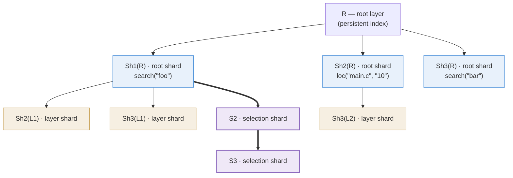

A statement's **materialisation** is the set of rows its layer-creating
commands write. Those rows have to be stored somewhere, and *how* they
are stored turns out to be a caching question rather than a bookkeeping
one.

A materialisation is not one opaque result. It is a set of
contributions with wildly different costs and lifetimes, and holding it
as a single unit lets the cheapest and most volatile of them decide the
fate of the most expensive — one ephemeral layer upstream, and a scan of
the whole corpus is redone.

So the storage takes the shape the caching problem dictates, and this
page derives it: §1 fixes the notation, §2 states the axiom a verb must
satisfy for the split to lose nothing, §3 carves the materialisation and
gives each part the key it earns, and §4 says why those keys can be
trusted; a worked example and the operating rules follow. For where
materialisation sits in the pipeline, see
[the life of a query](/docs/design/overview/#the-life-of-a-query).

## 1. Notation {#notation}

The layer data model — kinds, lifetimes, visibility, isolation,
garbage collection — belongs to
[Layers and layer operations](/docs/design/layers). This section fixes
only the symbols the argument uses.

**Layers and content.** The layer universe \(L\) is a set of nodes, each
\(\ell \in L\) carrying a **parent** \(\pi(\ell)\), undefined for a root
layer, so \(\pi\) induces a forest with one tree per root; a **key**
\(\kappa(\ell)\), a cryptographic hash that is its cache identity; and
**content** \(C(\ell)\), the rows physically stored on it — indexed
facts (a symbol, an instance of it, a reference to it) and, on a root,
the indexed source text those facts came from. Every stored row carries
the layer it lives on — **one row, one layer** — so distinct layers'
contents are pairwise disjoint and every union below is a genuine
partition.

**Roots and slices.** \(R_p\) is project \(p\)'s **root layer**, carrying
a stored **identity hash** \(h(R_p)\) that names the committed index
state it stands for (§4 makes that naming precise); a query runs against
a set of visible roots \(\mathcal{R}\) together with each root's
persistent closure — today just the root itself
([Layers](/docs/design/layers/#kinds-and-lifetimes)). Write
\(\Lambda_t(R)\) for the ordered **slice** visible on \(R\)'s project
after statement \(t\): that closure, followed by the materialisations of
statements \(1 \dots t\) in order. A query's visibility is the union of
the per-project slices; everything below works within one slice, and
[Layer Tree Extensions](/docs/design/layer-tree-extensions) handles
several projects at once. Existing layers, the root included, are never
written — a materialisation only ever adds nodes.

**Statements and materialisations.** A query evaluates layer-creating
top-level statements \(t = 1, 2, \dots\) in source order, and each
produces exactly **one** materialisation per visible root — one
altogether in the single-project case this page runs in. Within the
statement the layer-creating unit is the *command*: each layer-bearing
command \(c\) — the statement's own or a nested substatement's —
contributes one **node group**, and the materialisation is the union of
those groups. Nesting never sequences — the statement separator is the
only time axis ([terminology](/docs/design/overview/#terminology)) — and
every populate of statement \(t\) reads the slice as it stood after
statement \(t-1\), never a statement-mate's layers.

**The input hash.** Each command is summarised in one canonical **input
hash** \(H(c)\), built so that two commands with equal \(H(c)\) are
semantically identical. How \(H(c)\) is assembled is its own subsystem
([Layer Keys and Hashing](/docs/design/layer-keys)); here we use only
two of its properties: \(H(c)\) names every input the command's
populates read *except the layer contents they are aimed at* — those are
named by the node keys of §3 — and nothing else.

**Stored and observed content.** The command's **combined populate**
\(U_c\) maps an input slice — some layers' content rows — to every
row its content verbs write for it; the **content map**
\(f_c = \sigma_{F_c} \circ U_c\) conjoins the combined filter \(F_c\)
([Queries and their Meaning §5](/docs/design/semantics/#content-map)).
The engine stores the \(U_c\)-image and reads observe \(f_c\); since
\(C(\cdot)\) means stored rows the algebra below runs over \(U_c\),
and \(f_c\) reappears where reads do (§3).

## 2. Verb semantics and the decomposition axiom {#decomposition-axiom}

Everything §3 builds rests on one property of the combined populate
\(U_c\): its work can be split along layers. This section states that
property.

How individual verbs' populates union into \(U_c\) belongs to
[Queries and their Meaning](/docs/design/semantics). The
tree never decomposes below one command's node group, so here \(U_c\)
is one opaque function: aimed at the content rows of some set of
layers, it returns the content the command writes for just those rows.
And because \(U_c\) is a function, the same work can be aimed at
different slices — \(U_c(C(R))\) is the populate aimed at the root's
content, \(U_c(C(\ell))\) the same populate aimed at one layer's
content. The partitioning below is available exactly when aiming
\(U_c\) at slices separately loses nothing — when the value of a
disjoint union is the union of the values:

> **Axiom (layer-decomposability).** Over any family of layers (their
> contents are pairwise disjoint),
> $$U_c\Bigl(\bigcup_{\ell} C(\ell)\Bigr) \;=\; \bigcup_{\ell} U_c\bigl(C(\ell)\bigr)$$

A map with this property is an **additive map**: it adds up over
disjoint pieces the way lengths or counts do. The populates below
have it for the strongest possible reason — they are *element-wise*,
\(f(A) = \bigcup_{x \in A} f(\{x\})\), and an element-wise map is
additive over every disjoint split, layer families included.

By that same algebra \(U_c\) is a union of its content verbs'
populates, so the axiom is really an obligation on individual
populates. Substring search and location resolution meet it: a
byte-range match lies within exactly one **object** (one indexed
source file, itself a stored row), so each populate is per-row
behaviour computed one row at a time. A cross-layer operation — one
whose output on a row depends on *other* layers' rows — fails exactly
that row-at-a-time character and is by construction no part of
\(U_c\): the command algebra routes such **selection-dependent** rows,
built from earlier statements' selections, out of the populates, and
§3 gives them their own node: the selection shard.

## 3. Partitioning: the three node kinds {#node-kinds}

The cache in question is the **database-backed** one: a node
is a row in `index.layers` together with its content rows, named by a
hash of the command's inputs and shared across processes and queries.
Read results have a separate in-RAM cache, keyed on the exact SQL and
binds, which this page does not model
([Caching](/docs/design/caching/#two-tiers)).

**The problem.** A command \(c\) of statement \(t\) has to materialise
the rows its combined populate produces over everything visible:
\(U_c\bigl(\bigcup_{\ell \in \Lambda_{t-1}(R)} C(\ell)\bigr)\). Three
forces act on how that row set should be stored.

- **Cache the expensive.** The populate over the committed corpus is
  the costly part — scanning millions of indexed rows — and the corpus
  it reads almost never changes. Work like that must be stored once
  and reused.
- **Isolate the volatile.** Other inputs change constantly: an
  ephemeral layer appears, a referenced selection shifts by one row.
  Store the contribution as *one* node keyed on everything it read —
  the whole slice \(\Lambda_{t-1}(R)\) — and the cheapest, most
  volatile input dictates the fate of the most expensive work: one
  added layer upstream changes the key, so every **context** (every
  distinct history of ephemeral layers a query has built up) re-runs
  the corpus populate to produce rows an earlier context already
  produced. Keyed on the whole slice, the cache never hits across
  contexts.
- **Keep nodes few.** Every node is a row to insert and populate in
  its own transaction, and one more entry for eviction to track.
  Splitting is not free either.

The first two forces push towards splitting the contribution, the
third against it. The rest of this section carves it where they
balance.

**Step 1 — write down what a materialisation must produce.** Fix one
visible root \(R\): materialisations are per root (§1), the per-root
parts are independent, and \(M_t\), \(M_c\), and everything below
carry that silent \(R\) index. Everything statement \(t\)
materialises — its **materialisation content** \(M_t\) — is the
union, over its layer-bearing commands \(c\), of one **contribution**
\(M_c\) per command: the combined populate over the pre-statement
slice, plus a **selection-dependent term** — rows the command builds
from each referenced output, \(g_c(o)\) per output. \(O_c\) is the
set of outputs the command references via `@labels` — **selections**
of *earlier* statements only, each complete once its statement has
fully run ([terminology](/docs/design/overview/#terminology),
[The Execution Engine](/docs/design/execution-engine)); a reference to
the defining statement or any later one is a parse error, the
**ordering rule**
([label ordering](/docs/syntax/#ordering-labels-reference-earlier-statements)).
In the current engine the term is realised by `layer { … }` ops, and
for a pure content verb \(O_c\) is empty.

$$M_t \;=\; \bigcup_{c} M_c \qquad\quad M_c \;=\; U_c\Bigl(\,\bigcup_{\ell \,\in\, \Lambda_{t-1}(R)} C(\ell)\Bigr) \;\cup \bigcup_{o \,\in\, O_c} g_c(o)$$

The pre-statement read (§1) and the ordering rule combine into the
dependency invariant the whole tree leans on: **everything \(M_c\)
reads or points at exists in the pre-statement slice**. \(U_c\) reads
its content directly; each referenced output is the completed
selection of a statement that has fully run, and its resolved ids name
rows already stored. Nothing current or future is readable or
referenceable — which makes a statement's contributions mutually
independent and keeps every dependency edge the cache records (§4's
eviction) pointing only backwards in time.

**Step 2 — carve it along its dependencies.** Give each part a key
that names exactly what that part reads, and a change to one input can
invalidate only the parts that read it: volatility stops propagating
into expensive work. The carve is available because the selection term
is already per output — each op reads one selection — and the axiom
splits the content term per layer.

Write \(E_t(R)\) for the **content-bearing** light layers the
statement sees: the layers of \(\Lambda_{t-1}(R) \setminus \{R\}\)
that carry rows content populates read at all — *light* meaning any
visible layer other than the root, currently the ephemeral ones.
They are enumerated from the stored rows before any populate runs, so
the set is deterministic per query text and chain, and uniform across
the statement's commands; a light layer outside it contributes an
empty unit, not stored. The carve, with the key each part earns:

$$M_c \;=\; \underbrace{U_c(C(R))}_{\mathrm{Sh}_c(R)\;:\;(h(R),\,H(c))} \;\cup \bigcup_{\ell \,\in\, E_t(R)} \underbrace{U_c(C(\ell))}_{\mathrm{Sh}_c(\ell)\;:\;(\mathrm{id}(\ell),\,H(c))} \;\cup\; \underbrace{\bigcup_{o \,\in\, O_c} g_c(o)}_{S_c(R)\;:\;(\mathrm{id}(\mathrm{tip}_{t-1}(R)),\,H(c),\,\mathrm{extra})}$$

Each label is the node's key: **its parent's identity, its command,
and whatever else its content reads**. For the two shards the parent
*is* the input, so naming it settles content and placement at once;
the selection shard's parent is a position rather than an input, and
what its rows read is named by \(\mathrm{extra}\).

Each part is one node, and the three differ exactly as the three
forces predict:

- The **root shard** \(\mathrm{Sh}_c(R)\) holds the expensive populate
  over the committed bulk. Its key names the
  corpus and the command, nothing else, so no ephemeral change can
  reach it; only a mutation of the persistent index invalidates it
  (assumption A3 in §4).
- A **layer shard** \(\mathrm{Sh}_c(\ell)\) holds the same populate over
  one light layer, keyed by that layer's
  identity: of the context, only \(\ell\) itself. A layer appearing
  or vanishing invalidates its own shard and no other.
- The **selection shard** \(S_c(R)\) holds the whole
  selection-dependent term,
  \(C(S_c(R)) = \bigcup_{o \in O_c} g_c(o)\) — the outputs share one
  node rather than getting one each. These rows are the cheapest to
  produce (a batch insert of rows already computed) and the most
  volatile, so a finer split would spend nodes to protect work that
  is cheap to redo. Coarsening is safe as well as thrifty: a
  too-coarse key can only fragment the cache, never alias two
  different results. It is parented on the previous *statement's*
  tip, so successive tips form a chain — the **spine** — off which a
  multi-command statement's other selection shards hang as siblings;
  its key **folds** (hashes in) the identity of that parent, plus the
  resolved ids it read. (Splitting per output is the natural
  refinement should output-derived work stop being cheap —
  [Layer Tree Extensions](/docs/design/layer-tree-extensions).)

One rule covers both decisions — the shards kept apart, the outputs
put together: **split where the parts differ in cost or volatility,
and let them share a node where they do not.** Splitting below a layer
is barred twice over: a key can name a layer or a selection and
nothing smaller, and rows within one layer share a fate anyway.

Every part is computed against the same pre-statement slice, and the
statement's layers enter visibility together atomically. The spine
advances **once** per statement: all of a statement's selection shards
parent on \(\mathrm{tip}_{t-1}(R)\), and only the last becomes the new
tip, defined below.

In one line: **input shards are built on inputs, the selection shard
on outputs.**

For each layer-bearing command \(c\), with those keys in byte-exact
form:

| Node | Content | Parent | Key |
|---|---|---|---|
| **Root shard** \(\mathrm{Sh}_c(R)\) | \(U_c(C(R))\) | \(R\) | \(\kappa = \mathcal{H}(\, \mathrm{dom}_{\mathrm{root}} \,\Vert\, h(R) \,\Vert\, H(c) \,)\) |
| **Layer shard** \(\mathrm{Sh}_c(\ell)\), one per \(\ell \in E_t(R)\) | \(U_c(C(\ell))\) | \(\ell\) | \(\kappa = \mathcal{H}(\, \mathrm{dom}_{\mathrm{layer}} \,\Vert\, \mathrm{id}(\ell) \,\Vert\, \kappa_{\mathrm{root}} \,)\) |
| **Selection shard** \(S_c(R)\) | \(\bigcup_{o \in O_c} g_c(o)\) | \(\mathrm{tip}_{t-1}(R)\) | \(\kappa = \mathcal{H}(\, \mathrm{dom}_{\mathrm{sel}} \,\Vert\, \mathrm{id}(\mathrm{tip}_{t-1}(R)) \,\Vert\, \kappa_{\mathrm{root}} \,\Vert\, \mathrm{extra} \,)\) |

In the key column: \(\mathcal{H}(\cdot)\) is the raw cryptographic
hash over byte strings; \(\Vert\) is byte concatenation;
\(\mathrm{id}(\cdot)\) is a database id, so the selection shard folds
the tip's *id*, not its key; \(\mathrm{extra}\) is what a node reads
beyond the one input its parent names; the \(\mathrm{dom}\) prefixes
are per-kind domain-separation tags, and the byte layout is
[Keys](/docs/design/layer-keys)' subject. Note that the two non-root
keys fold \(\kappa_{\mathrm{root}}\), the root shard's own key, rather
than \(H(c)\) directly: a layer or selection shard is thus tied to the
exact root-shard incarnation it was cached against, and inherits its
project scoping for free. In the
current deployment no verb writes content onto an ephemeral layer, so
\(E_t(R)\) is empty and each command materialises just a root shard
and a selection shard.

For a pure content verb (\(O_c\) empty) the selection shard is empty,
surviving as a deterministic **spine marker**. The tip advances once
per statement: \(\mathrm{tip}_t(R)\) is
the **last layer of materialisation \(t\) in command pre-order** — the
final layer-bearing command's selection shard — with
\(\mathrm{tip}_0(R) = R\). One exception: a statement that runs with
no ephemeral layers visible (the first statement) materialises no
selection shards at all, and its tip is then the last root shard in
pre-order. Either way the tip is deterministic: pre-order is source
order and each command's internal layer order is canonical, so the
tip is a pure function of the query text and the pre-statement chain.

The design rule the table encodes:

> **A node's key names exactly what a cache hit reuses — the inputs its
> content is a function of, and the place it occupies — and nothing
> more.**

A hit hands back a whole node: its rows *and* its parent edge. For the
shards those two duties coincide, since the parent is the input. They
part company at the selection shard, whose rows are fixed by
\((H(c), \mathrm{extra})\) alone: its parent is named not because the
content reads it but because the node is also the spine marker, and
markers must be one per statement. Were position left out of the key,
two statements running the same command with no outputs would share a
single node, and the spine would have nowhere to record their order.

The tree's shape is thus the dependency structure of \(M_c\), cut
where those dependencies differ in cost and volatility: as many nodes
as that requires, and no more.

Two consequences are worth reading off the carve directly. First, the
split loses nothing: the parts were defined as a decomposition of
\(M_c\), and by §1's row-identity convention they are disjoint, so a
read of the whole node group returns exactly \(M_c\) — with an elided
unit contributing \(\emptyset\), and a materialisation's read the
union of its commands'. That is stored content; because
\(\sigma_{F_c}\) acts row by row it distributes over the union, so a
read that conjoins \(F_c\) observes \(f_c\) over the pre-statement
slice, as §1 promised.

Second, the reuse the whole design exists for. \(\kappa\bigl(\mathrm{Sh}_c(R)\bigr)\)
mentions no ephemeral layer, so **one** root shard serves every
upstream context — the expensive populate is run once and shared for
as long as the corpus stands. \(\kappa\bigl(\mathrm{Sh}_c(\ell)\bigr)\)
mentions nothing of the context but \(\ell\), so its layer shard is
shared by every context containing \(\ell\). Only selection shards are
context-specific, and for commands that consume no selections they are
empty markers. A "cache hit" is simply node identity: the node already
exists, so its populate never runs. Parent every layer on the previous
one instead — the naive topology — and this evaporates: each context
grows its own copy of the same populate.

## 4. Why a key can be trusted {#key-trust}

Everything above rests on one property: **equal keys, equal content**
— \(\kappa(\ell) = \kappa(\ell') \Rightarrow C(\ell) = C(\ell')\).
A cache hit skips a populate on the strength of a name, so if two
nodes could share a key while holding different rows, a query would
silently read someone else's answer.

The property is not proved here; it is arranged by construction. Every
key names its parent's identity, its command, and whatever else its
content reads (§3's rule), so equal keys mean equal named inputs — and
equal inputs mean equal content, provided each name is faithful to
what it stands for. Three facts make it so, all supplied by the engine
rather than by this algebra:

- **(A1) Two-phase population.** A node is observable only fully
  written or not at all, and is never rewritten afterwards — the
  upsert-plus-`populated`-flag transaction of
  [Caching](/docs/design/caching/#populated-guard). So a
  layer's content is written once, and an id that names the layer
  names its rows.
- **(A2) Id non-reuse.** An id names at most one row over the
  database's lifetime — layer ids and the row ids a key may fold alike
  ([Caching](/docs/design/caching)). So folding an id folds an
  identity, and equal parent ids mean the same node, hence the same
  chain behind it.
- **(A3) Root pinning.** \(h(R)\) determines the persistent content it
  stands for: every mutation of the persistent index purges the
  ephemeral cache in the same transaction, so no cached node outlives
  a change to what its \(h(R)\) named.

Given those, the shards inherit their content's identity from their
parent's — \(h(R)\) pins \(C(R)\) by (A3), \(\mathrm{id}(\ell)\) pins
\(C(\ell)\) by (A1) and (A2) — while a selection shard's rows are
fixed by \(H(c)\) and \(\mathrm{extra}\) alone, so its key determines
more than it needs to. Eviction preserves the arrangement rather than
breaking it: the delete-cascade
([Caching](/docs/design/caching/#lifetime-and-invalidation)) removes a
layer together with everything transitively dependent on it, so a live
node's ancestry is always present and, by (A1), unchanged.

## 5. Worked example {#worked-example}

One project, root **R**; three layer-creating statements
\(t = 1, 2, 3\), each a single layer-bearing command — \(c\) implicit,
nodes indexed by statement number. To exercise all three node kinds,
assume each root shard's layer carries content for later populates to
read (with today's verbs none does):

```askl
search("foo") ; loc("main.c", "10") ; search("bar")
```

- Statement 1 runs with an empty ephemeral suffix: just **Sh1(R)**,
  which doubles as the spine marker (the exception in §3). As a layer
  in later statements' visibility it is **L1**.
- Statement 2 has \(E_2 = \{L1\}\): **Sh2(R)** (as a layer:
  **L2**), layer shard **Sh2(L1)**, selection shard **S2** parented on L1.
- Statement 3 has \(E_3 = \{L1, L2\}\) — Sh2(L1) and S2 are visible
  too, but carry only derived index rows, nothing a populate reads —
  so: **Sh3(R)**, layer shards **Sh3(L1)**, **Sh3(L2)**, selection
  shard **S3** parented on S2.



The bold edges are the **spine** — the only lineage encoding query
history (code: `tip`).

Statement 3 stores the union over its materialisation's nodes:
\(C(\mathrm{Sh3}(R)) \cup C(\mathrm{Sh3}(L1)) \cup C(\mathrm{Sh3}(L2))
\cup C(S3)\); its read observes that union under the command's
filter. L2's rows reach statement 3 through Sh3(L2), **not**
through Sh3(R) — which is what keeps \(\kappa(\mathrm{Sh3}(R))\)
context-free. And by §3's reuse argument, running `search("bar")` alone
tomorrow, or under a different upstream context, hits the same Sh3(R)
node; only the context-specific remainder differs.

## 6. Practical consequences {#practical-consequences}

The formalism condenses into four operating rules:

- **Visibility is a flat set, never a subtree** — queries bind
  `visible_ids()`, the union of the visible slices (§1); nothing walks
  the forest at read time.
- **Only the spine orders anything** — `tip` =
  \(\mathrm{tip}_t(R)\), deterministic by §3's pre-order rule.
- **Isolation is visibility read in reverse** — a returned row outside
  the visible set is a leak
  ([Layers and layer operations](/docs/design/layers)).
- **Invalidation is (A3) enforced** — persistent-index mutations purge
  the ephemeral cache in the same transaction; nothing else does.

## 7. Prior art {#prior-art}

Naming a unit of work by a hash of its inputs, so that the name alone
decides reuse, is well-trodden ground: **OCI/Docker** image layers,
**Nix** derivations, and **Bazel**'s action cache all do it, and §4's
"equal keys, equal content" is the invariant they also depend on. The
other half of the lineage is **materialised views with incremental
maintenance**, where a stored result stays usable as its inputs change,
and where the decomposition that makes maintenance affordable runs over
the input relations. What seems less usual here is the axis of the split:
one operator's output is decomposed along a *visibility chain*, and each
part is keyed so that a volatile input cannot invalidate a stable one —
\(\kappa(\mathrm{Sh}_c(R))\) mentions no ephemeral layer at all. Where
the carve stops is then an economic question rather than a structural one
(§3), which is why the selection shard is a single node rather than one
per output.

## Where to read more

- [Queries and their Meaning](/docs/design/semantics)
- [Layers and layer operations](/docs/design/layers)
- [Caching](/docs/design/caching)
- [search()](/docs/design/search)
